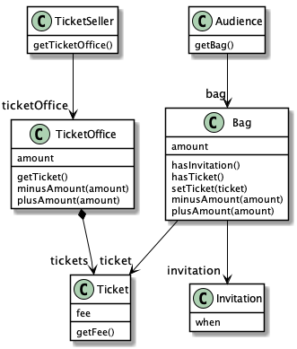
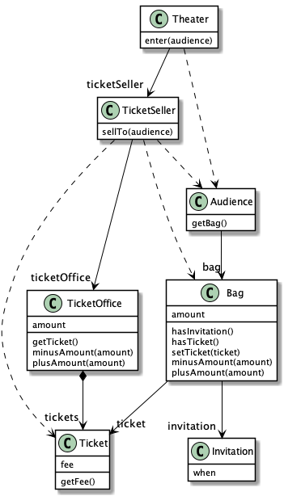

# Chapter 1. 객체, 설계

---

## 01. 티켓 판매 애플리케이션 구현하기

---

## 02. 무엇이 문제인가

---

- 소프트웨어 모듈의 3가지 목적
    1. 실행 중에 제대로 동작하는 것.
    2. 변경을 위해 존재하는 것. 변경하기 어려운 모듈은 제대로 동작 하더라도 개선해야 한다.
    3. 코드를 읽는 사람과 의사소통하는 것. 특별한 훈련 없이도 개발자가 쉽게 읽고 이해할 수 있어야 한다.

- 문제점
    - 관람객과 판매원이 소극장의 통제를 받는 수동적인 존재
    - 세부적인 내용들을 한꺼번에 기억하고 있어야 한다
        - Audience가 Bag을, Bag은 amount, ticket을, TicketSeller가 TicketOffice, Ticket을, TicketOffice안에 amount, ticket을 갖고 있음을 동시에 기억해야함

            → 복잡 & 어려움

    - 변경에 취약한 코드
        - 만약 TicketOffice밖의 TicketSeller가 Ticket을 판매해야 한다면?
        - 만약 Audience가 Bag이 없다면?
        - 만약 Audience가 신용카드로 결제한다면?

- 의존성(dependency)

변경에 대한 영향을 암시한다. 어떤 객체가 변경될 때 그 객체에게 의존하는 다른 객체도 함께 변경될 수 있다는 사실이 내포돼 있다.

- 결합도(coupling)

객체 사이의 의존성이 과한 경우를 가리켜 결합도가 높다고 말한다. 결합도는 의존성과 관련돼 있기 때문에 결합도 역시 변경과 관련이 있다.

## 03. 설계 개선하기

---

자율성을 높이자

- 기존문제

    Theater가 Audience, TicketSeller, Audience.Bag, TicketSeller.TIcketOffice 까지 맘대로 접근할 수 있어 설계를 변경하기 어려웠다.

- Theater.enter(): TicketSeller.sellTo() 인터페이스 의존으로 변경

    → 객체를 인터페이스와 구현으로 나누고 인터페이스만 공개하는 것은 객체 사이의 결합도를 낮추고 변경하기 쉬운 코드를 작성하기 위해 따라야 하는 가장 기본적인 설계 원칙.

    → Theater에서 TicketOffice로의 의존성이 제거됐다. TicketOffice와 협력하는 TicketSeller의 내부 구현(TicketOffice)이 성공적으로 캡슐화 되었다.

    

- TicketSeller.sellTo(): Audience.buy() 인터페이스 의존으로 변경

    → TicketSeller 와 Audience 간 결합도가 낮아졌다. 내부 구현을 외부에 노출하지 않고(캡슐화) 자신의 문제를 스스로 책임지고 해결하는 자율적인 존재가 되었다.

    

- 캡슐화와 응집도

핵심은 객체 내부의 상태를 캡슐화하고 객체 간에 오직 메시지를 통해서만 상호작용하도록 만드는 것

자신의 데이터를 스스로 처리하는 자율적인 객체를 만들면 결합도를 낮추고 응집도를 높인다.

- 응집도(cohesion)

밀접하게 연관된 작업만 수행하고 연관성 없는 작업은 다른 객체에게 위임하는 것.

- 절차지향과 객체지향
- 절차지향
    - 프로세스와 데이터를 별도의 모듈에 위치시키는 방식 → 절차적 프로그래밍
    - 예시
        - Theater가 TicketSeller, TicketOffice, Audience, Bag 모두에 의존 중.
        - enter 메소드 자체가 프로세스다.
        - Audience, TicketSeller, Bag TicketOffice는 데이터.
    - 문제점
        - 데이터 변경으로 인한 영향을 지역적으로 고립시키기 어렵다.
        - 절차적 프로그래밍은 프로세스가 필요한 모든 데이터 의존적 문제점 때문에 변경에 취약하다.
- 객체지향
    - 변경하기 쉬운 설계. 한 번에 하나의 클래스만 변경할 수 있는 설계.
    - 데이터와  프로세스가 동일한 모듈 내부에 위치시키는 방식 → 객체지향 프로그래밍
    - 핵심
        - 캡슐화를 이용해 의존성을 적절히 관리한다.
        - 객체 사이의 결합도를 낮춘다. 각 객체는 자신을 스스로 책임진다.
        - 절차지향에해 변경에 좀 더 유연하다.

- 책임의 이동(shift of responsibility)
- 예시
    - 책임이 Theater에 집중돼 있었다. Theater가 전체적인 작업을 도맡아 처리했다.
    - 수정 후 개별 객체로 책임이 이동했다.

## 04. 객체지향 설계

---

- 좋은 설계
- 설계란 코드를 배치하는 것
- 오늘 완성해야 하는 기능을 구현하는 코드 & 내일 쉽게 변경할 수 있는 코드
- 변경을 수용할 수 있는 설계
    - 요구 사항이 항상 변경되기 때문이다.
    - 코드를 변경할 때 버그가 추가될 가능성이 높기 때문이다.
    - 이해하기 쉬운 코드
- 훌륭한 객체 지향 설계
    - 협력하는 객체 사이의 의존성을 적절하게 관리하는 설계.
    - 이를 위한 첫걸음은 데이터와 프로세스를 하나의 덩어리로 모으는 것.
    - 변경에 용이한 설계.