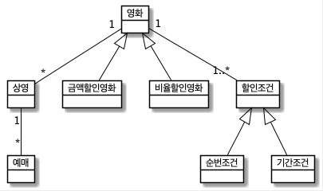

# Chapter 5. 책임 할당하기

## 01. 책임 주도 설계를 향해

- 데이터보다 행동을 먼저 결정하라
- 협력이라는 문맥 안에서 책임을 결정하라
- 책임 주도 설계
    - 시스템이 사용자에게 제공해야 하는 기능인 시스템 책임을 파악
    - 시스템 책임을 더 작은 책임으로 분할
    - 분할된 책임을 수행할 수 있는 적절한 객체 또는 역할을 찾아 책임을 할당
    - 객체가 책임 수행 도중 다른 객체의 도움이 필요한 경우 이를 책임질 적절한 객체 또는 역할을 찾는다.
    - 해당 객체 또는 역할에게 책임을 할당 → 두 객체가 협력하게 한다.

## 02. 책임 할당을 위한 GRASP  패턴

GRASP 패턴 (일반적인 책임 할당을 위한 소프트웨어 패턴)

1. 도메인 개념에서 출발하기
    - 설계 시작 단계에서는 개념들 의미, 관계가 완벽할 필요가 없다. 책임 할당받을 객체들의 종류, 관계에 대한 정보를 제공할 수 있다면 충분. 빠르게 설계와 구현을 진행하라.

    

2. 정보 전문가에게 책임을 할당하라
    - 애플리케이션이 제공해야 하는 기능을 애플리케이션의 책임으로 생각하는 것.
    - 이 책임(메시지)을 책임질 첫 번째 객체를 선택하자.
        - 사용자에게 제공해야 하는 기능: 영화 예매
            - 기능 = 책임, 애플리케이션은 영화 예매할 책임이 있다.
            - 필요한 메시지 결정
                - 메시지를 전송할 객체의 의도를 반영해서 결정 (수신할 객체 x)
                1. 메시지를 전송할 객체는 무엇을 원하는가? → 영화 예매
                2. 메시지를 수신할 적합한 객체는 누구인가? → 상영 (INFORMATION EXPERT)

                    영화에 대한 정보, 상영 시간, 상영 순번, 영화 예매에 필요한 다양한 정보를 알고있다.

                    - 외부에 대한 요청 = 새로운 메시지
                        - (가격 계산) → 영화
                        - (할인 요금 계산) → 할인 조건

    - INFORMATION EXPERT 패턴

    책임을 객체에 할당하는 일반적인 원리. 책임을 수행하는 데 필요한 정보를 가지고 있는 객체에게 할당하라.

3. 높은 응집도와 낮은 결합도
    - LOW COUPLING 패턴

    의존성을 낮추고 변화의 영향을 줄이며 재사용성을 증가시키자. 설계의 전체적인 결합도가 낮게 유지되도록 책임을 할당하라.

    - HIGH COHESION 패턴

    복잡성을 관리할 수 있는 수준으로 유지하자. 높은 응집도를 유지할 수 있게 책임을 할당하라.

4. 창조자에게 객체 생성 책임을 할당하라
    - CREATOR 패턴

    객체 생성 책임을 할당 방식. 객체 A를 생성해야 할 때, 다음 조건을 최대한 많이 만족하는 B에게 객체 생성 책임을 할당하라.

    - 조건
        - B가 A 객체를 포함하거나 참조한다.
        - B가 A 객체를 기록한다.
        - B가 A 객체를 긴밀하게 사용한다.
        - B가 A 객체를 초기화하는 데 필요한 데이터를 가지고 있다.(정보 전문가)

    어떤 방식으로든 생성되는 객체와 연결되거나 관련될 필요가 있는 객체에 해당 객체를 생성할 책임을 맡기는 것. 이미 결합돼 있는 객체에게 생성 책임을 할당하면 전체 결합도에 영향을 미치지 x → 낮은 결합도 유지

    - 영화 예매 협력의 최종 결과물, Reservation 인스턴스 생성하기
        - CREATOR → 상영: 예매 정보를 생성하는 데 필요한 영화, 상영 시간, 상영 순번 등 정보전문가. 예매 요금 계산에 필수적인 영화 도 알고 있다.

## 04. 책임 주도 설계의 대안

리팩터링

- 메서드 응집도

    응집도 높은 메서드는 변경되는 이유가 단 하나여야 한다.

- 객체를 자율적으로 만들자

    메서드가 사용하는 데이터를 저장하고 있는 클래스로 메서드를 이동시키자.

https://www.notion.so/Chapter-5-39a1af69a7b74821929b6d43c907f2d9
