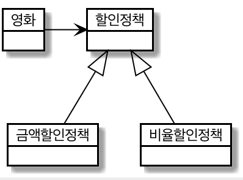
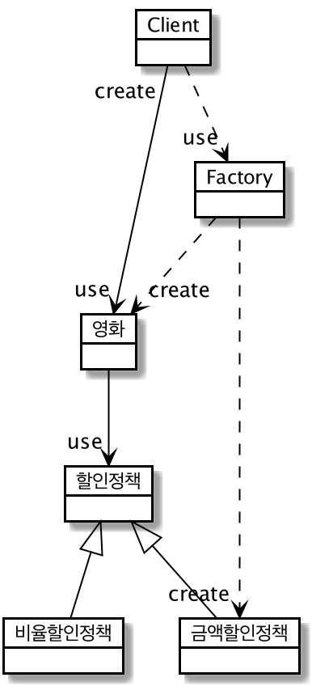
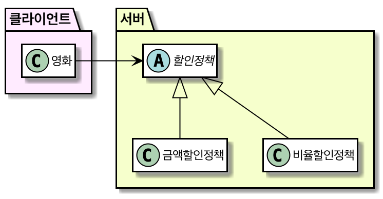
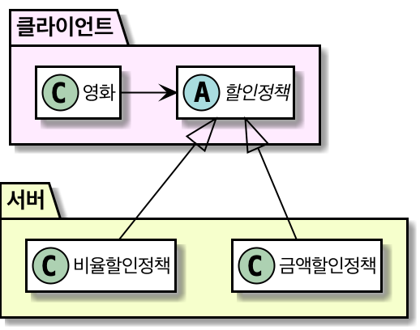

# Chapter 9. 유연한 설계


## 01. 개방-폐쇄 원칙


- 소프트웨어 개체(클래스, 모듈, 함수 등)는 확장에 대해 열려있어야 하고, 수정에 대해 닫혀있어야 한다.
    - 확장에 대해 열려있다: 애플리케이션 요구사항이 변경될 때 이에 맞게 새 동작을 추가해서 기능 확장할 수 있다.
    - 수정에 대해 닫혀있다: 기존 코드를 수정하지 않고도 애플리케이션 동작 추가, 변경할 수 있다.
- 컴파일타임 의존성을 고정시키고 런타임 의존성을 변경하라

    

- 추상화에 의존한다.
    - 추상화: 핵심 부분만 남기고 불필요한 부분은 생략하여 복잡성 극복하는 기법. 공통 부분은 문맥이 바뀌어도 변하지 않아야 한다.

추상화를 했다고 모든 수정에 대해 설계가 폐쇄되는 것은 아니다. 변하는 것, 변하지 않는 것 이해하고 추상화의 목적으로 삼자.

## 02. 생성 사용 분리


- 추상화에만 의존하기 위해서는 해당 추상화의 구체 클래스 인스턴스를 생성해서는 안된다.

    → 할인 정책을 변경할 방법은 직접 코드를 수정하는 것 뿐, 개방-폐쇄 원칙 위반.

- 메시지를 전송하지 않고 객체를 생성만 하거나, 객체를 생성하지 않고 메시지를 전송만 하거나!

    → 동일 클래스 내 2가지 이질적인 목적(객체 생성, 사용) 가진 코드가 공존하면 문제.

- 생성과 사용을 분리

소프트웨어 시스템은 (응용 프로그램 객체를 제작하고 의존성을 서로 연결하는) 시작 단계와 (시작 단계 이후에 이어지는) 실행 단계를 분리해야 한다.

- FACTORY 추가하기

생성과 사용을 분리하기 위해 객체 생성과 관련된 책임만 전담하는 별도의 객체를 FACTORY 라고 부른다.



- 순수한 가공물에게 책임 할당하기

책임을 할당하기 위해 창조되는 도메인과 무관한 인공적인 객체를 순수한 가공물이라고 부른다.

## 03. 의존성 주입


의존성을 해결하기 위해 의존성을 객체의 퍼블릭 인터페이스에 명시적으로 드러내서 외부에서 필요한 런타임 의존성을 전달할 수 있도록 만드는 방법을 포괄하는 명칭.

1. 생성자 주입

    객체를 생성하는 시점에 생성자를 통한 의존성 해결. 객체 생명주기 전체에 걸쳐 관계를 유지. 객체가 올바른 상태로 생성되는 데 필요한 의존성을 명확하게 표현할 수 있다는 장점이 있지만, 주입된 의존성이 1, 2개 메서드에서만 사용된다면 단점이 될 수 있다.

2. setter 주입

    객체 생성 후 setter 메서드를 통한 의존성 해결. 언제라도 의존 대성을 교체할 수 있다는 장점이 있고, 객체가 올바로 생성되기 위해 어떤 의존성이 필수적인지 명시적으로 표현할 수 없다는 단점이 있다.

3. 메서드 주입

    메서드 실행 시 인자를 이용한 의존성 해결.  메서드가 의존성을 필요로 하는 유일한 경우일 때 사용할 수 있다. 주입된 의존성이 1, 2개 메서드에서만 사용된다면 메서드의 인자로 전달하는 것이 더 나은 방법일 수 있다.

4. 숨겨진 의존성은 나쁘다

    Service Locator 패턴의 단점은 의존성을 감춘다는 것이다. Movie 는 DiscountPolicy 에 의존하고 있지만, Movie 의 퍼블릭 인터페이스에 이 의존성에 대한 정보가 표시돼 있지 않다. 정적 변수를 사용해 객체들을 공유, 관리하기 때문에 각 단위 테스트는 서로 고립돼야 한다는 기본 원칙을 위반하게 된다.

    → 숨겨진 의존성은 캡슐화를 위반한다. 가급적 의존성을 객체의 퍼블릭 인터페이스에 노출하라.

- SERVICE LOCATOR 패턴

의존성을 해결할 객체들을 보관하는 일종의 저장소. 객체가 직접 SERVICE LOCATOR 에게 의존성을 해결해줄 것을 요청한다.

ex> 게임 플랫폼의 오디오, 디스플레이 시스템처럼 본질적으로 하나뿐일 때 사용하면 좋다. 

```java
public class ServiceLocator {
    private static ServiceLocator soleInstance = new ServiceLocator();
    private DiscountPolicy discountPolicy;

    public static DiscountPolicy discountPolicy() {
        return soleInstance.discountPolicy;
    }

    public static void provide(DiscountPolicy discountPolicy) {
        soleInstance.discountPolicy = discountPolicy;
    }

    private ServiceLocator() {
    }
}
```

```java
public class Movie {
    private String title;
    private Duration runningTime;
    private DiscountPolicy discountPolicy;

    public Movie(String title, Duration runningTime, DiscountPolicy discountPolicy) {
        this.title = title;
        this.runningTime = runningTime;
				// Service Locator 패턴
        this.discountPolicy = ServiceLocator.discountPolicy();
    }
}
```

접근할 객체가 있다면 전역 메커니즘 대신, 필요 객체를 인수로 넘겨주자. 결합을 명확히 보여줄 수 있다.

## 04. 의존성 역전 원칙


- 추상화와 의존성 역전: 방향
    - 어떤 협력에서 중요한 정책이나 의사결정, 비즈니스의 본질을 담고 있는 것은 상위 수준의 클래스
        - 영화, 금액할인정책 간 협력이 가지는 본질: 영화 가격을 계산하는 것.
        - 어떻게 할인 금액을 계산할 것인지는 협력의 본질이 아니다.
    - 추상화에 의존하라(추상 클래스, 인터페이스)
        - 구체 클래스는 의존성의 시작점, 목적지가 아니다.

- 의존성 역전 원칙
1. 상위 수준의 모듈은 하위 수준의 모듈에 의존해서는 안된다. 둘 모두 추상화에 의존해야 한다.
2. 추상화는 구체적인 사항에 의존해서는 안된다. 구체적인 사항은 추상화에 의존해야 한다.

- 의존성 역전 원칙과 패키지: 인터페이스의 소유권
    - 모듈: OOP 에서 어떤 구성 요소의 소유권을 결정하는 것.
    - 자바는 패키지를 이용해 모듈을 구현.
    - 전통적인 설계 패러다임은 인터페이스의 소유권을 서버 모듈에 위치시키는 반면, 잘 설계된 객체지향 애플리케이션에서는 클라이언트에 위치시킨다.

        

        

## 05. 유연성에 대한 조언


- 유연한 설계는 유연성이 필요할 때만 옳다.
- 협력과 책임이 중요하다. 불필요한 싱글톤 패턴을 지양하자.

https://www.notion.so/Chapter-9-18d4fe902a0943fbaa9b18c01bda097c
